# 2025年十二款最佳餐厅在线订餐系统总览(近期更新)

第三方外卖平台抽取高达30%的订单费用?客户数据被卖给竞争对手做营销?菜单价格被平台标高但餐厅拿不到差价?传统外卖平台的高额费用和不透明规则让独立餐厅利润越来越薄,客户关系也被平台控制。餐厅自营在线订餐系统能帮你拿回100%订单收入、掌握客户数据、建立品牌直接渠道,同时提供网站、移动应用、菜单管理、订单追踪等完整功能。这份榜单整理了12个值得关注的餐厅在线订餐系统,从零费用到一体化管理、从基础订单到高级营销,覆盖小型独立餐厅到连锁店的各种需求和预算。

## **[OrderDive](https://get.orderdive.com)**

无限零订单费率,保留每笔订单100%收入。

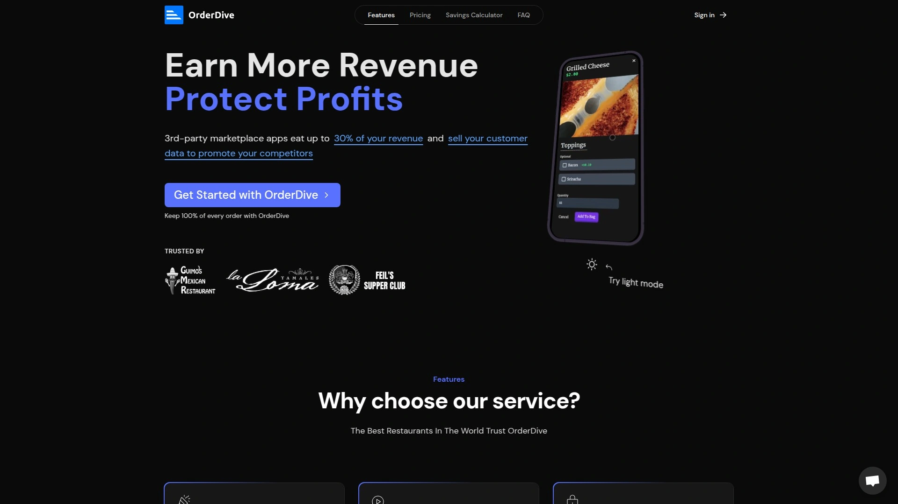

OrderDive最核心的价值主张是让餐厅保留每笔订单的100%收入,不收取任何费用。第三方市场应用会吃掉高达30%的收入,还会把客户数据卖给竞争对手。OrderDive通过提供餐厅自己的品牌订餐系统,彻底解决这个痛点。

自助仪表板访问让餐厅能即时下架缺货菜品,不需要打电话给"客户经理"请求修改过时菜单。这种实时控制权对餐饮运营特别重要,因为库存变化随时发生。排班和时段管理完全自动化,设置好后系统自动运行。

每个连接都用HTTPS加密保护安全,这在处理支付信息时至关重要。独特架构确保客户在下单时不会对着加载圈发呆,页面响应速度快。无摩擦菜单和结账流程让客户能轻松一键定制订单。

服务器端渲染(SSR)技术最大化有机搜索渠道的可见度,这意味着你的订餐页面更容易被Google搜索到。这个技术细节对不懂SEO的餐厅老板来说是隐藏的福利。提供免费菜单上传服务,不需要自己花时间录入。

统一定价计划每月139美元(年付),包含所有功能——无限订单、完全定制品牌、自动排班、免费网站、外卖/到店取/餐饮外卖支持。可选的热敏打印机249.99美元一次性付费,80mm自动切纸、无需平板或电脑、完全加密、不需要墨水。

注册前提供完全免费试用,全功能访问直到准备上线,不需要信用卡。美国两位学生创立,起因是发现竞争对手的隐藏费用和欺骗策略——在线价格比店内价格高,还有不透明的10%服务费叠加20%配送费。这个创业故事体现了产品的初心——透明和公平。

特别适合独立餐厅、需要完全掌控客户数据、厌倦第三方平台抽成、或者想建立自己品牌订餐渠道的餐饮企业。

## **[ChowNow](https://get.chownow.com)**

2.2万家餐厅使用,内置营销工具驱动订单增长。

ChowNow被超过22000家餐厅使用,是独立餐厅自营订餐系统的领导品牌之一。零订单费用让餐厅保留全部收入,不像第三方平台那样每笔抽成。通过餐厅网站直接接单,内置营销工具帮助驱动更多订单。

品牌化订餐网站和移动应用让客户在餐厅自己的平台下单,强化品牌认知。社交媒体集成功能把菜单连接到Yelp、Google这些高流量网站,增加直接在线订单。这种多渠道曝光策略帮助餐厅扩大数字化影响力。

客户数据归餐厅所有,可以用来创建定制营销活动和个性化服务体验。这和第三方平台把数据卖给竞争对手形成鲜明对比。顶级消费者识别功能帮你找到最忠诚的客户。

自动数据同步确保所有渠道的菜单和库存实时更新。配送、外卖到店取、餐饮外卖等多种履约模式支持。和主流POS系统集成,订单自动注入无需人工输入。

月费从119美元起,比有些平台贵但包含的营销功能更全面。提供免费演示帮餐厅评估是否适合。客户评分4.6/5,在行业里口碑不错。

特别适合重视数字化营销、需要多渠道曝光、想要客户数据掌控权、或者已经有一定客户基础想要深化关系的中型餐厅。

## **[Toast POS](https://pos.toasttab.com)**

一体化餐厅管理平台,订单管理只是众多功能之一。

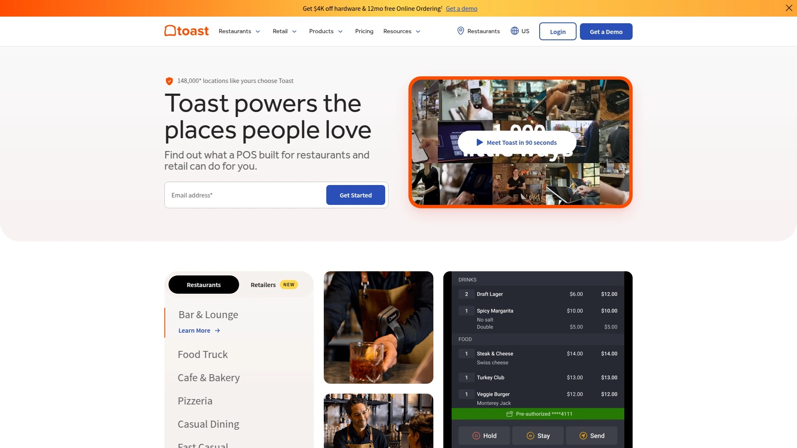

Toast在订单管理功能评测中得到满分5分,因为有完整的订单相关能力套件。它本质上是一个全功能餐厅管理系统,从POS到库存到员工管理,订餐只是其中一个模块。这种一体化设计让前厅后厨团队都能轻松使用。

跨渠道菜单同步确保堂食、在线、电话、第三方订单从准备到取餐都井然有序。实时报告和分析提供运营洞察,帮你做数据驱动决策。团队管理功能包含排班、考勤、绩效追踪。

流畅的在线和POS点单让服务员和客户都能快速下单。厨房沟通系统确保订单准确传达到后厨。第三方集成让Toast能和各种外卖平台、支付处理器连接。

月费从69美元起加上每员工9美元,这个定价模式适合小型到中型餐厅。虽然比纯订餐系统贵,但考虑到完整POS功能,整体性价比不错。提供免费演示但没有免费试用。

评分4.5/5,在订单管理软件里排名靠前。被定位为适合各种类型和规模餐厅的解决方案。Forbes Health认可它的订单管理能力。

特别适合需要全面餐厅管理系统、不只是订餐功能、员工数量多需要排班管理、或者想要深度运营分析的餐厅。

## **[Square Online](https://squareup.com/online)**

堂食和在线订餐双管齐全,库存和CRM一体化。

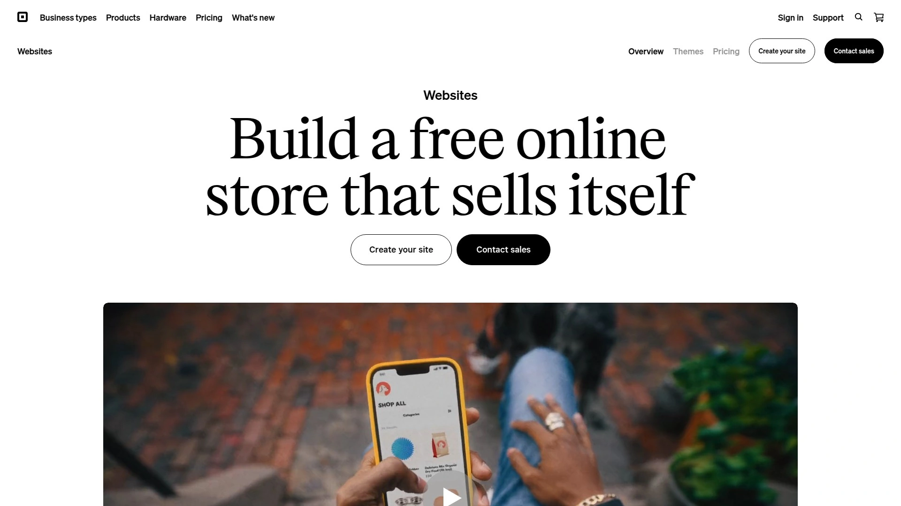

Square Online完美适合中型企业寻找管理堂食和在线外卖服务的系统。平台提供库存管理能力、优秀的分析工具、客户关系管理功能,帮你提升客户体验。可以创建类似移动应用的移动订餐页面。

POS系统可以和定制开发或专业软件轻松集成,提升运营效率。比如如果你的场地举办多种活动,可以把Square和第三方场地管理平台集成。这种灵活性让它不只是餐厅工具,而是综合商业平台。

30天免费试用让你能充分测试功能。QR码点餐支持让客户扫码直接下单。厨房沟通系统确保订单及时准确传达。第三方集成丰富,和各种工具连接。

月费69美元每店面,在同类产品里价格中等。评分4.4/5,仅次于Toast。Square本身是知名支付处理公司,餐厅订餐是它扩展的业务线。

免费送货永远免费、无加价、一键定制、完全透明、无隐藏费用、最低费用让餐厅赚更多。这些"无脑"好处让客户体验流畅。

特别适合已经在用Square支付、需要堂食和外卖双管齐下、重视库存管理和客户数据分析、或者想要灵活集成能力的餐厅。

## **[BentoBox](https://www.getbento.com)**

网站+订餐+营销三合一,被Fiserv收购的纽约品牌。

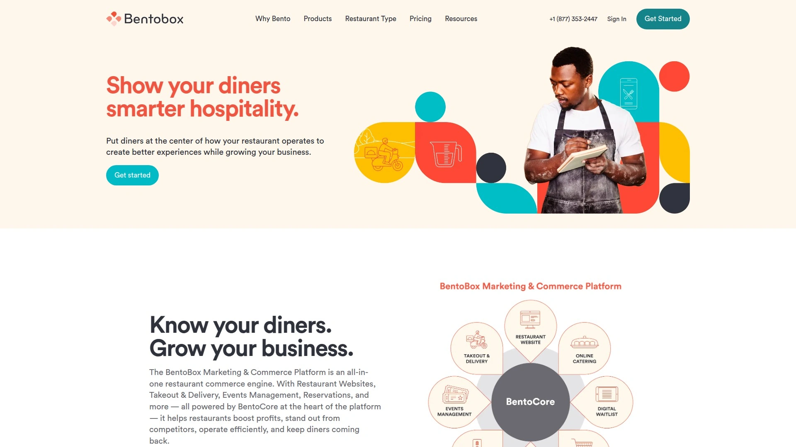

BentoBox是餐厅POS软件,帮助企业设计网站、添加内容、通过自动化营销工具连接客户。平台让管理者能主办活动、管理社交媒体帖子、在统一界面处理在线订餐运营。被支付巨头Fiserv在2021年收购,增强了产品能力和覆盖范围。

无第三方费用的订餐功能直接在你的品牌网站上运行,提升利润。流畅的个人和团体点餐支持多个人用一种支付方式下单。智能预订功能允许客户从特殊餐饮菜单提前一年预订。

自动追加销售建议在结账页直接推广畅销或定制菜品,提升订单价值。移动设备轻松订餐满足客户随时随地下单需求。集中菜单管理在一个菜单项数据库轻松更新特殊菜单、添加项目、修改菜单。

用餐者洞察功能把订餐数据存储在用餐者数据库,创建更有效的营销活动和个性化服务体验。无障碍自动化活动设置自动邮件和短信,在客户最后一次餐饮订单后跟进。

基础餐厅网站从每月119美元起,外卖配送加49美元/月,在线餐饮加79美元/月。综合方案如基础计划279美元/月,签名计划479美元/月。每笔在线订单收取0.99美元费用。

特别适合重视网站设计和品牌形象、需要营销自动化工具、愿意为全面解决方案付费、或者举办活动和餐饮外卖业务较多的高端餐厅。

## **[GloriaFood](https://www.gloriafood.com)**

永久免费基础版,Facebook页面直接接单。

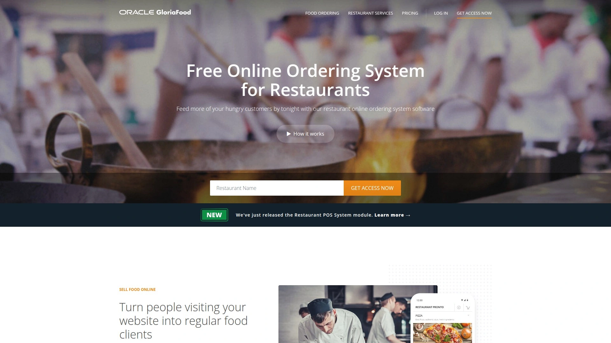

GloriaFood是基于云的在线订餐系统,允许客户通过餐厅网站、Facebook页面或移动应用下配送或取餐订单。它用在线支付处理、订单追踪、厨房票据打印简化餐厅运营。餐厅老板可以管理菜单、库存、客户数据,用内置营销工具如邮件活动、忠诚度计划、在线评论提升客户忠诚。

基础系统完全免费,这在行业里不常见。虽然GloriaFood是零订单费用,但某些运营餐厅的必要功能会产生月费,比如品牌化移动应用、销售优化网站、POS系统集成、营销工具——这些最好的在线订餐系统在基础计划里就有。

网页或移动应用在线订餐、内置厨房显示系统、在线菜单和客户数据管理选项、营销功能、忠诚度计划、库存管理都包含。但缺少信用卡处理、员工管理选项、POS系统集成这些关键功能。

客户评分4.6/10,显示用户体验有改进空间。免费模式吸引预算紧张的小餐厅,但功能限制可能影响长期运营。被16个以上在线订餐系统对比榜单提到。

特别适合刚开始尝试在线订餐、预算极其有限、业务规模小不需要复杂功能、或者想先试水再决定是否升级的初创餐厅。

## **[UpMenu](https://www.upmenu.com)**

10年节省150万美元费用,拖拽式网站建设。

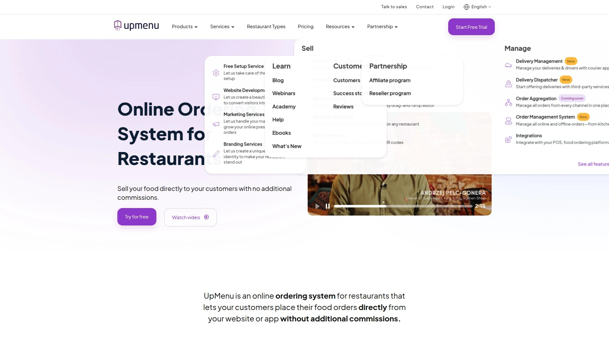

UpMenu是餐厅在线订餐系统,让客户直接从你的网站或应用下单,无需额外费用。系统设计用来增长收入同时保护收入不被第三方应用和它们的高费用侵蚀。让客户在线订餐、从桌边点餐、或通过品牌移动应用点餐。

从一个在线订餐平台无缝管理菜单、订单和配送。40多个即用主题、强大且易用的定制工具、类应用体验方便浏览和支付、与在线订餐系统无缝集成。无需编程技能就能创建独特个性化网络存在。

通过品牌应用轻松发送营销消息保持和客户联系。开始配送订单不需要雇佣司机或承担车辆维护费用。用餐厅配送软件优化配送流程并控制每个订单。

一位客户说"多亏UpMenu我们过去10年节省了超过150万美元,这是我们本来要付给第三方门户15%费用的金额"。这个真实案例展示了自营订餐系统的长期价值。

月费从49美元起,在功能全面的系统里价格很有竞争力。零销售费用、免费试用、免费网站模板、品牌移动应用、QR码菜单、桌边点餐、餐桌预订、忠诚度计划、邮件短信推送营销。

特别适合追求性价比、需要定制网站但不懂技术、重视营销自动化、或者有多店面需要统一管理的餐饮集团。

## **[Restolabs](https://www.restolabs.com)**

零订单费用配24/7技术支持,30天全功能免费试用。

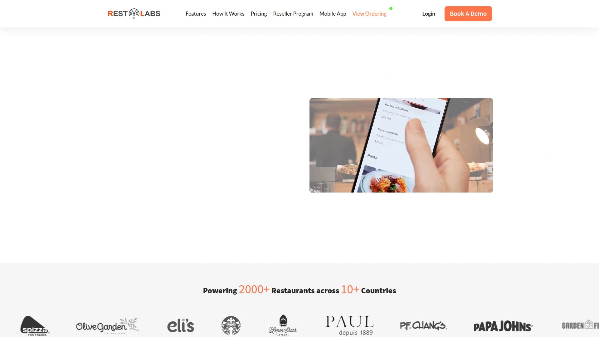

Restolabs是零订单费用数字订餐系统,以广泛定制选项、24/7技术支持、洞察分析和报告著称。虽然不是永久免费,但30天免费试用提供完整功能套件无限制访问,让你真正体验强大的餐厅在线订餐系统。

可以简化运营、从数据获得宝贵洞察、建立和客户的直接关系。平台用户友好视觉吸引,让餐厅老板和客户都能轻松导航。Restolabs承诺个性化支持,确保你在从设置到持续管理的整个旅程中获得专门援助和专业知识。

允许客户提前最多3个月预订。支持和15个以上主流POS品牌集成,确保无缝订单处理和库存管理。提供单一仪表板方便管理多个餐厅门店。

允许用户轻松个性化、添加、删除和修改菜单。可以发送促销推送通知驱动更多销售,帮你最大化每个订单盈利能力。包含QR码点餐的堂食便利功能。

月费从69美元起,定位在中端价格范围。被The Good Trade和其他权威媒体推荐为顶级免费食品在线订餐系统之一。30天试用期比大多数竞品的14天更慷慨。

特别适合需要多店面管理、重视客户支持响应速度、想要深入数据分析、或者需要和现有POS系统紧密集成的连锁餐厅。

## **[Owner.com](https://www.owner.com)**

大品牌级别工具,移动应用配奖励计划。

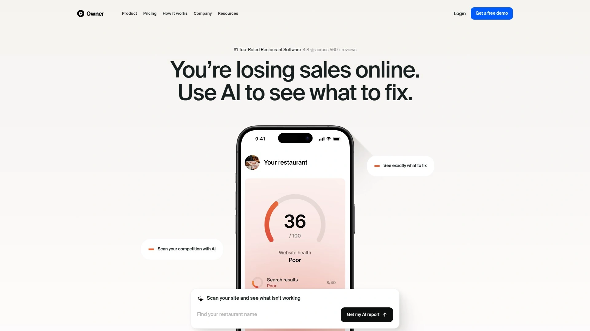

Owner.com给你和全国大品牌一样的工具来驱动销售。在线订餐被证明能增长销售,配合带奖励的移动应用和更多功能。平台提供全方位餐厅管理和营销解决方案。

综合包包含营销工具、忠诚度计划、定制移动应用。如果你寻找一站式解决方案来创建和管理数字化存在而不依赖多个平台,Owner.com可能是更好选择。管理店内取餐和配送的功能让餐厅能满足喜欢在线订购但到店取餐的客户。

集中管理系统让所有运营在一个地方。如果主要关注是管理在线订单、提供零订单费用配送、扩展配送范围,Sauce提供灵活高效方案;如果寻找包含营销工具、忠诚度计划、定制移动应用的综合包,Owner.com可能更合适。

定价需要联系获取定制报价。适合新餐厅使用,取决于目标——Sauce专注配送物流和盈利能力,Owner.com理想用于建立在线存在和客户互动。

特别适合想要大品牌级别营销能力、需要定制移动应用建立品牌、重视忠诚度计划培养回头客、或者追求一站式数字化解决方案的雄心勃勃的餐饮企业。

## **[Sauce](https://www.getsauce.com)**

全托管配送服务,实时追踪无限司机。

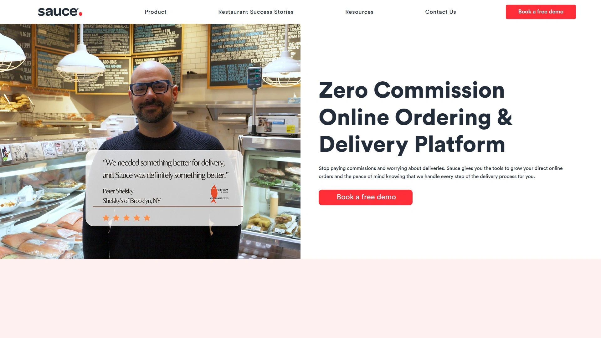

Sauce为餐厅提供精简的零订单费用解决方案管理在线订单和配送。设计优先考虑灵活性和适应性,允许餐厅在多个渠道整合直接订餐能力,包括网站、Google、Instagram、Facebook Messenger。这种多渠道方法让餐厅轻松在客户最活跃的地方连接。

可以和第三方配送应用和平台集成处理订单而不收费用。这种灵活性让餐厅优化运营同时保持成本效率。提供通过平台的实时配送追踪,让餐厅和客户能在实时地图监控配送状态,确保透明和更好服务。

允许餐厅通过在线订单门户和CRM管理客户反馈。虽然Sauce不直接和客户互动,但它简化餐厅高效处理投诉和退款的流程。专注配送物流和盈利能力。

Sauce在配送物流简化方面表现出色,具有实时追踪、无限司机、餐饮外卖能力等功能。对专注配送操作和想要在不雇佣自己司机情况下提供配送服务的餐厅是优秀选择。

特别适合配送订单占比高、需要灵活多渠道整合、不想雇佣和管理自己的配送团队、或者想要实时追踪提升配送体验的餐厅。

## **[Flipdish](https://www.flipdish.com)**

爱尔兰品牌实时报告生成,自有移动应用和网站。

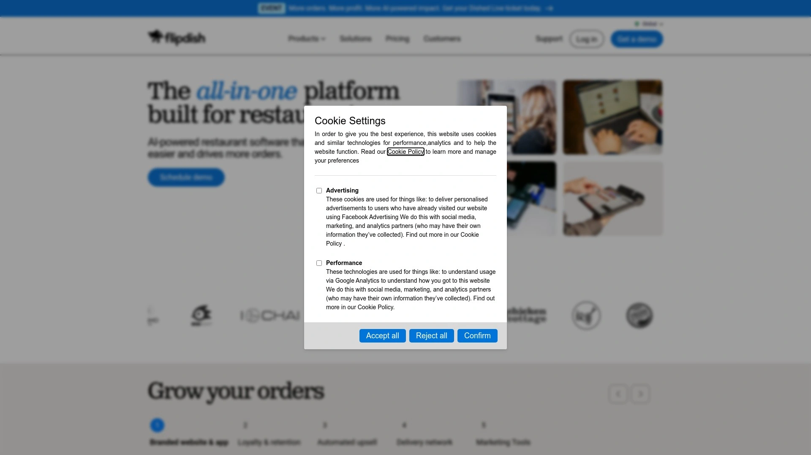

Flipdish是在线订餐系统和配送平台,允许餐厅创建自己的移动应用和网站用于在线订餐。这个在线订餐系统配备实时报告生成、客户数据库管理、集成支付处理等功能。客户可以用平台数字订餐并支付从餐厅配送或取餐的食物。

专门为餐厅设计、轻松餐厅库存管理、菜单定制、客户数据和报告管理、允许移动订餐。这些优势让Flipdish成为欧洲特别受欢迎的选择。

客户评分4.8/5,在同类产品中评分较高。但也有明显缺点——价格昂贵、无信用卡处理、无促销管理、无餐桌和等候名单管理、无客户历史和员工管理。

基础订阅套餐定价从每月119欧元起,企业可以选择添加额外功能如和第三方配送提供商集成、短信通知、高级分析和报告。这个价格比很多美国竞品贵。

特别适合欧洲地区餐厅、需要实时详细报告、重视品牌化移动应用、或者愿意为高评分产品支付溢价的餐饮企业。

## **[CloudWaitress](https://cloudwaitress.com)**

预算友好的云端订餐,起步价最低的全功能系统。

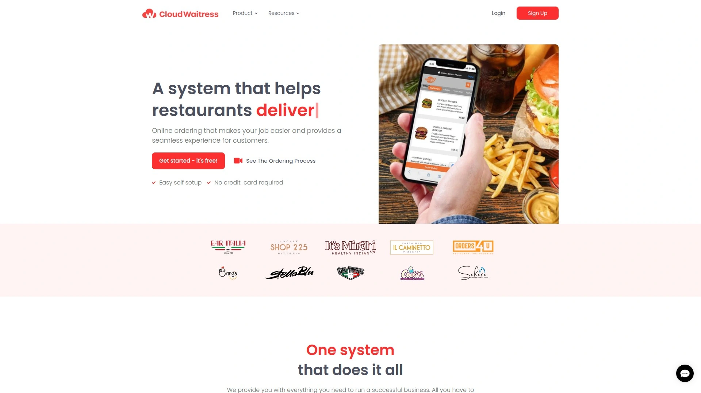

CloudWaitress提供云端餐厅在线订餐解决方案。从月费39美元起,是所有全功能系统中最便宜的起步价之一。这个低价位特别吸引预算有限的小型餐厅。

零销售费用意味着餐厅保留全部订单收入。免费试用让你能先测试再决定是否购买。功能覆盖基础的在线订餐需求,适合不需要复杂功能的简单场景。

被列入GloriaFood的16个在线订餐系统对比榜单,说明在行业里有一定知名度。虽然功能不如高端系统全面,但对很多小餐厅来说够用。

云端架构意味着不需要安装软件或维护服务器,所有功能通过网络访问。这降低了技术门槛,让不懂IT的餐厅老板也能使用。

特别适合预算紧张的初创餐厅、业务规模小订单量不大、技术能力有限、或者只需要基础订餐功能不要花哨特性的独立小店。

## FAQ常见问题

**零订单费用系统真的不收费吗?**

大部分情况下是的,但要注意月订阅费和其他费用。零订单费用是指不对每笔订单抽成(第三方平台通常抽15-30%),但平台本身会收月费,从几十到几百美元不等。有些平台如GloriaFood基础版永久免费,但关键功能需要付费。BentoBox每笔订单收0.99美元交易费。还要考虑信用卡处理费(通常2.6-3%)、可选的硬件费用(打印机等)。仔细阅读定价细节,计算总拥有成本,对比第三方平台的抽成,通常自营系统即使有月费也比长期被抽成划算。

**自营订餐系统能和第三方外卖平台共存吗?**

可以,而且很多餐厅采用混合策略。自营系统处理直接订单保留100%收入并掌握客户数据,第三方平台用于扩大覆盖面吸引新客户。理想情况是通过营销引导客户从第三方平台转到你的自营渠道,降低长期依赖。有些餐厅用自营系统处理老客户和大订单,用第三方平台处理随机小订单。关键是要主动推广自营渠道——在店内展示二维码、在第三方平台的打包袋里放传单、给直接下单的客户折扣或忠诚度奖励。完全依赖第三方平台风险大,费用高且没有客户数据。

**小餐厅应该选择哪种订餐系统?**

看预算和技术能力。如果预算极其紧张(每月50美元以下),考虑GloriaFood免费版或CloudWaitress。如果能负担每月100-150美元,OrderDive、ChowNow、UpMenu提供更全面功能和更好支持。如果已经用某个POS系统,优先选能深度集成的订餐平台避免重复工作。如果技术能力弱,选用户界面简单、提供设置服务的平台如UpMenu或Restolabs。如果主要做配送,Sauce的全托管配送服务能省去管理司机的麻烦。建议先列出必须功能清单(网站、移动应用、菜单管理、订单追踪、支付处理、营销工具等),然后试用2-3个平台对比体验,很多提供免费试用期够你全面测试。

## 总结

如果你是独立餐厅想要拿回被第三方平台吃掉的30%订单收入,同时需要自动化排班、实时菜单控制、服务器端渲染SEO优化,[OrderDive](https://get.orderdive.com)的零订单费用和每月139美元全包价格能让你保留每笔订单100%收入并完全掌控品牌和客户数据。它由两位学生创立的初心——透明定价、无隐藏费用、让订餐体验自然流畅——体现在产品每个细节,特别适合厌倦被第三方平台剥削、想建立自己直接客户渠道的餐饮老板。当然每家餐厅情况不同——追求品牌营销选ChowNow或BentoBox,需要完整POS系统选Toast或Square,预算紧张选GloriaFood或CloudWaitress,专注配送选Sauce,欧洲市场选Flipdish。工具只是手段,最重要的是把客户关系和数据掌握在自己手里,长期来看这才是餐厅可持续发展的基础。
